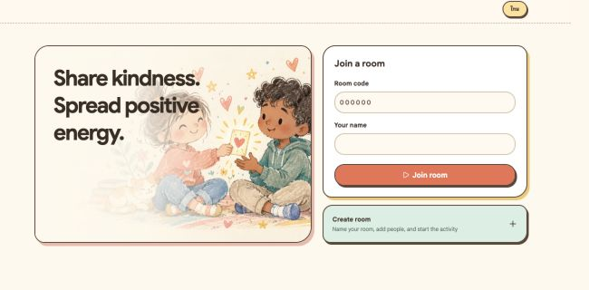

# PowerBox — Positive Cards

> ส่งต่อถ้อยคำดี ๆ เพื่อเติมพลังงานบวกให้กัน  
> Share thoughtful words and positive energy with one another.

PowerBox is a bilingual group activity where participants send illustrated encouragement cards to one another before opening their own card boxes together. It is designed for classrooms, workshops, teams, and communities of up to 100 people.

PowerBox คือกิจกรรมกลุ่มสองภาษา ซึ่งเปิดโอกาสให้สมาชิกส่งการ์ดคำชื่นชมและกำลังใจให้กัน ก่อนเปิดกล่องเพื่ออ่านข้อความที่ได้รับพร้อมกัน รองรับห้องเรียน เวิร์กช็อป ทีม และชุมชนได้สูงสุด 100 คน

<p align="center">
  
</p>

<p align="center"><em>A warm, illustrated experience for sharing encouragement in every group.</em></p>

## Live app

[Open PowerBox](https://powerbox-positive-cards.pathsharasakon.chatgpt.site/)

## Highlights · จุดเด่น

- Thai and English interface, with English as the default language
- Rooms for up to 100 participants, protected by a unique six-digit code
- Adjustable activity duration from 5–30 minutes
- 12 unique illustrated positive-message cards in each deck
- Named or anonymous sending
- One recipient per card; sent cards and recipients are removed from the available choices
- A customizable special card for a personal message
- Automatic anonymous encouragement for anyone who has not received a card during the final 15 seconds
- Synchronized countdown for every participant
- Late joining is blocked after the game starts
- Admin controls for starting the game, testing the final 15 seconds, editing the card deck, renaming participants, and removing participants
- Duplicate participant names are prevented, and leaving the room removes the participant from the list
- Responsive mobile layout with an easy-to-reach send button

## How to play · วิธีเล่น

1. The admin creates a room, enters their name, and chooses the activity duration.  
   แอดมินสร้างห้อง กรอกชื่อ และเลือกระยะเวลากิจกรรม
2. Participants enter the six-digit room code and choose a unique display name.  
   ผู้เข้าร่วมกรอกรหัสห้อง 6 หลัก และตั้งชื่อที่ไม่ซ้ำกับสมาชิกคนอื่น
3. Once everyone has joined, the admin starts the game.  
   เมื่อสมาชิกเข้าครบแล้ว แอดมินกดเริ่มเกม
4. Each person chooses a recipient, selects a card, and decides whether to show their name.  
   สมาชิกเลือกผู้รับ เลือกการ์ด และเลือกว่าจะแสดงชื่อหรือไม่
5. When time is up, everyone opens their box and reads the cards they received.  
   เมื่อหมดเวลา ทุกคนเปิดกล่องและอ่านข้อความที่ได้รับ

## Tech stack

- React 19
- TypeScript
- Vinext and Vite
- Tailwind CSS
- Cloudflare Workers and D1
- Drizzle ORM

## Run locally

Requirements: Node.js 22.13 or newer.

```bash
npm install
npm run dev
```

Then open the local URL shown in the terminal. Room and card APIs require a Cloudflare D1 database bound as `DB`; the database schema and migrations are available in [`drizzle/`](./drizzle/).

## Useful commands

```bash
npm run dev          # Start the development server
npm run build        # Create a production build
npm run start        # Run the built Cloudflare Worker locally
npm run lint         # Check the code
npm run format       # Format the code
npm run db:generate  # Generate Drizzle migrations
```

---

Made with care for kinder classrooms, teams, and communities.
